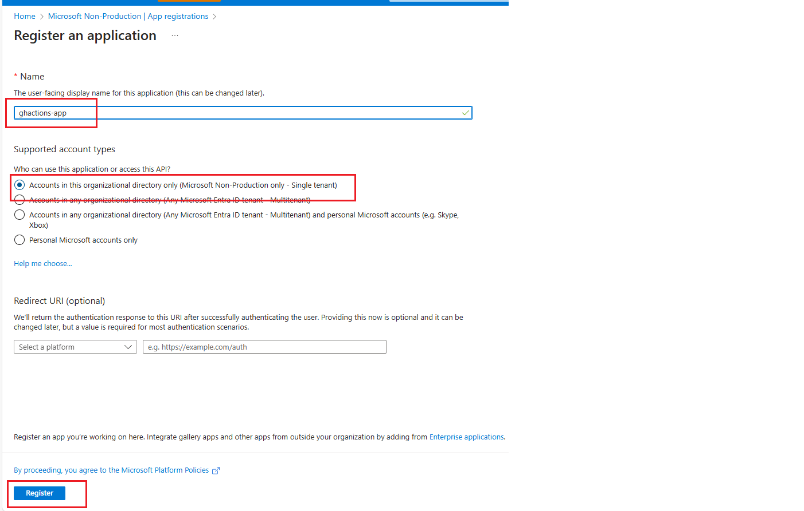
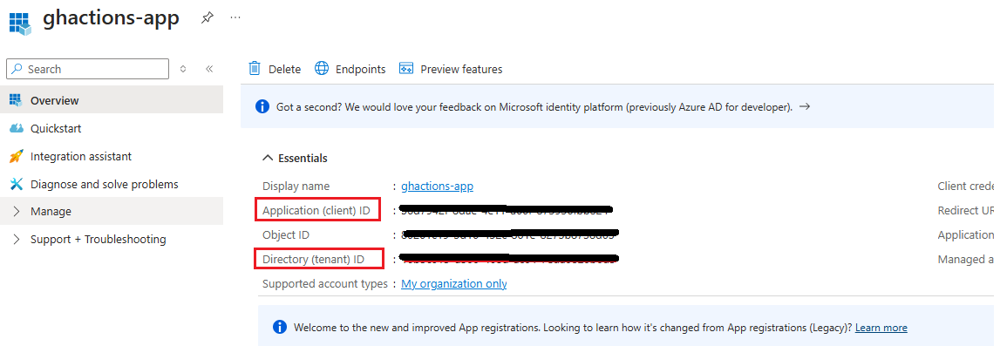
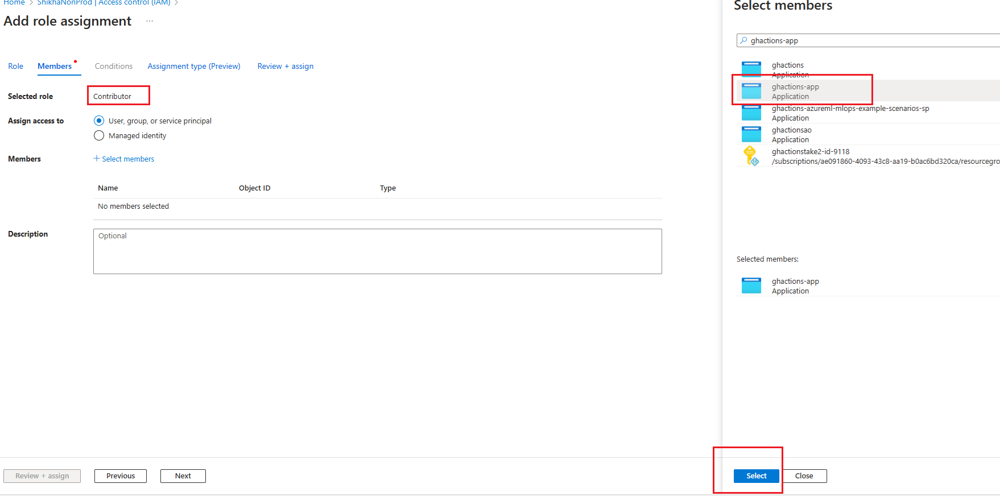

# Lab0 - Azure Login with OpenID Connect in GitHub Actions

## Overview

In this lab, you will learn how toget started with GitHub Actions by creating an Actions workflow to invoke tasks in a job. The workflow will perfoorm following tasks :

1. Login to Azure using OpenID Connect (OIDC) authentication.
2. Run some basic Azure CLI/Powershell commands to validate successful login.

## Prerequisites

To use the Azure Login action with OIDC, you need to configure a federated identity credential on a Microsoft Entra application or a user-assigned managed identity. In this lab we will look at the Microsoft Entra application approach.

### Set up a GitHub Repository for the Lab
Follow the steps below to set up a GitHub repository [___aks-github-actions-workhop___] for the lab: [Create a GitHub Repository](https://docs.github.com/en/repositories/creating-and-managing-repositories/quickstart-for-repositories).

### Microsoft Entra Application

1. **Create a Microsoft Entra Application**  
   You can create a Microsoft Entra application with a service principal using Azure Portal : 

   

2. **Obtain the Following Values:**
   - *Client ID*
   - *Subscription ID*
   - *Directory (tenant) ID*

   

   > **Note:** Make sure to store these values securely, as they will be used later in the GitHub Actions workflow to authenticate to Azure.

3. **Assign 'Contributor' Role to the Service Principal**  
   Use the Azure Portal, assign 'Contributor' role to your service principal.

   

4. **Configure a Federated Identity Credential**  
   Set up a federated identity credential on the Microsoft Entra application to trust tokens issued by GitHub Actions for your GitHub repository.

    

5. **Fetch values stored in Step 2 and add them as Secrets to the GitHub Repo as following: **
   - *AZURE_CLIENT_ID*
   - *AZURE_SUBSCRIPTION_ID*
   - *AZURE_TENANT_ID*

   

6. **Navigate to your GitHub Repository, select Action from the top menu and Add a workflow file:**

    

6. **Create a new workflow file and add copy the content of the following yaml file that creates a workdflow to login to Azure using OIDC:**

    * [GitHub Actions workflow to connect to Azure using OIDC](00-azure-oidc-login.yml) - 
