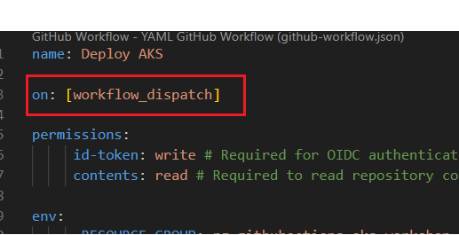

# Lab3: Deploying Nginx to AKS using GitHub Actions with `@azure/k8s-deploy`

## Objective:
This lab will guide you through the process of deploying an Nginx application to an Azure Kubernetes Service (AKS) cluster using GitHub Actions. The deployment will utilize the `@azure/k8s-deploy` GitHub Action for streamlined Kubernetes deployments.

## Prerequisites:
1. **Basic Knowledge**: Familiarity with Kubernetes, GitHub Actions, and YAML syntax. Ensure you have completed [Lab0-GitHub Actions 101](../01-gh-actions-101/readme.md) and have established successful connectivity between GitHub Actions and Azure.
1. **Azure CLI**: Installed and configured on your local machine. [How to install the Azure CLI](https://docs.microsoft.com/en-us/cli/azure/install-azure-cli)
1. **Kubectl**: Installed on your local machine. [How to install the Kubectl](https://kubernetes.io/docs/tasks/tools/)
1. **A cluster**: E.g. a deployment of [Lab2](../02-aks-101/lab2_aks_deployment_lab.md)
---

## Step 1: Create a Kubernetes Deployment Manifest for Nginx

1. **In your repository**, create a directory for Kubernetes manifests called `k8s` if it doesn't already exist.
   ```bash
   mkdir -p k8s
   ```

2. **Create a deployment YAML file**:
   ```bash
   touch k8s/nginx-deployment.yml
   ```

3. **Edit the deployment YAML file** with the following content:

   ```yaml
   apiVersion: apps/v1
   kind: Deployment
   metadata:
     name: nginx-deployment
   spec:
     replicas: 2
     selector:
       matchLabels:
         app: nginx
     template:
       metadata:
         labels:
           app: nginx
       spec:
         containers:
         - name: nginx
           image: nginx:latest
           ports:
           - containerPort: 80
   ```

4. **Create a service YAML file** to expose the Nginx deployment:
   ```bash
   touch k8s/nginx-service.yml
   ```

5. **Edit the service YAML file** with the following content:

   ```yaml
   apiVersion: v1
   kind: Service
   metadata:
     name: nginx-service
   spec:
     selector:
       app: nginx
     ports:
       - protocol: TCP
         port: 80
         targetPort: 80
     type: LoadBalancer
   ```

## Step 3: Create a GitHub Actions Workflow File

1. **In your repository**, navigate to the `.github/workflows` directory: 

2. **Create a new YAML file**:
   ```bash
   touch .github/workflows/deploy-nginx.yml
   ```
    *Alternatively, you can create the file manually in the `.github/workflows` directory*
3. **Edit the YAML file** with the following content:

   ```yaml
   name: Deploy Nginx to AKS

   on:
     push:
       branches:
         - main

   permissions:
     id-token: write # Required for OIDC authentication
     contents: read # Required to read repository contents
     actions: read # Required for GitHub Actions
     checks: write # Required for status checks

   env:
      RESOURCE_GROUP: myResourceGroup
      AKS_CLUSTER_NAME: myAKSCluster
   
   jobs:
     deploy:
       runs-on: ubuntu-latest

       steps:
       - name: Checkout the code
         uses: actions/checkout@v2

       - name: Azure Login
         uses: azure/login@v2
         with:
           client-id: ${{ secrets.AZURE_CLIENT_ID }}
           tenant-id: ${{ secrets.AZURE_TENANT_ID }}
           subscription-id: ${{ secrets.AZURE_SUBSCRIPTION_ID }}
           enable-AzPSSession: true

       - name: Set up Kubernetes tools
         uses: azure/setup-kubectl@v3
         with:
           version: 'latest'

       - name: Setup kubelogin
         uses: azure/use-kubelogin@v1
         with:
          kubelogin-version: 'v0.0.26'
       
       - name: Set AKS context
         id: set-context
         uses: azure/aks-set-context@v3
         with:
          resource-group: '${{ env.RESOURCE_GROUP }}' 
          cluster-name: '${{ env.AKS_CLUSTER_NAME }}'
          admin: 'false'
          use-kubelogin: 'true' 

       - name: Deploy to AKS
         uses: azure/k8s-deploy@v3
         with:
           manifests: |
             k8s/nginx-deployment.yml
             k8s/nginx-service.yml
           images: |
             nginx:latest
           namespace: default
           traffic-split-method: pod
   ```

> **Note:** 
     - Replace `myResourceGroup` with the name of your Azure Resource Group created in Lab2.
      - Replace `myAKSCluster` with your AKS cluster created in Lab2.
      - Ensure that the `k8s/nginx-deployment.yml` and `k8s/nginx-service.yml` file paths exist in your repository.

### Step 4: Change the Trigger Type of the `deploy-aks` workflow file created in Lab2 to `workflow_dispatch`

1. **In your repository**, navigate to the `.github/workflows` directory: 

3. **Update the trigger for ```deploy-aks.yml``` YAML file** from `push` to `workflow_dispatch`:

```yaml
   name: Deploy AKS

   on:
     workflow_dispatch:

  permissions:
     id-token: write # Required for OIDC authentication
     contents: read # Required to read repository contents
     '
     '
     '
```



## Step 5: Push the Changes to GitHub

1. **Stage, commit, and push** your changes:
   ```bash
   git add .
   git commit -m "Set up Nginx deployment workflow"
   git push origin main
   ```

2. **Monitor the GitHub Actions Workflow**:
   - Navigate to the Actions tab of your GitHub repository.
   - Watch the workflow as it runs, which will deploy the Nginx application to your AKS cluster.

## Step 5: Verify the Deployment

1. **Access the AKS Cluster**:
   - Run the following command to ensure you have the correct context:
     ```bash
     kubectl get nodes
     ```

2. **Verify the Deployment**:
   - Check the status of your deployment:
     ```bash
     kubectl get deployments
     ```

   - Check the running pods:
     ```bash
     kubectl get pods
     ```

3. **Access the Nginx Application**:
   - Retrieve the external IP of the Nginx service:
     ```bash
     kubectl get svc nginx-service
     ```
   - Open a web browser and navigate to the external IP address to see the Nginx welcome page.

## Step 6: Clean Up Resources

1. **Delete the Resource Group** (if no longer needed):
   ```bash
   az group delete --name myResourceGroup --yes --no-wait
   ```

---

## Conclusion

Congratulations! You have successfully deployed an Nginx application to an AKS cluster using GitHub Actions with the `@azure/k8s-deploy` action. This setup can be further expanded and customized to suit more complex CI/CD pipelines and Kubernetes deployments.

---

This document guides you through deploying Nginx to AKS using the `@azure/k8s-deploy` GitHub Action, which simplifies the deployment process by automating the steps involved in deploying Kubernetes manifests.
